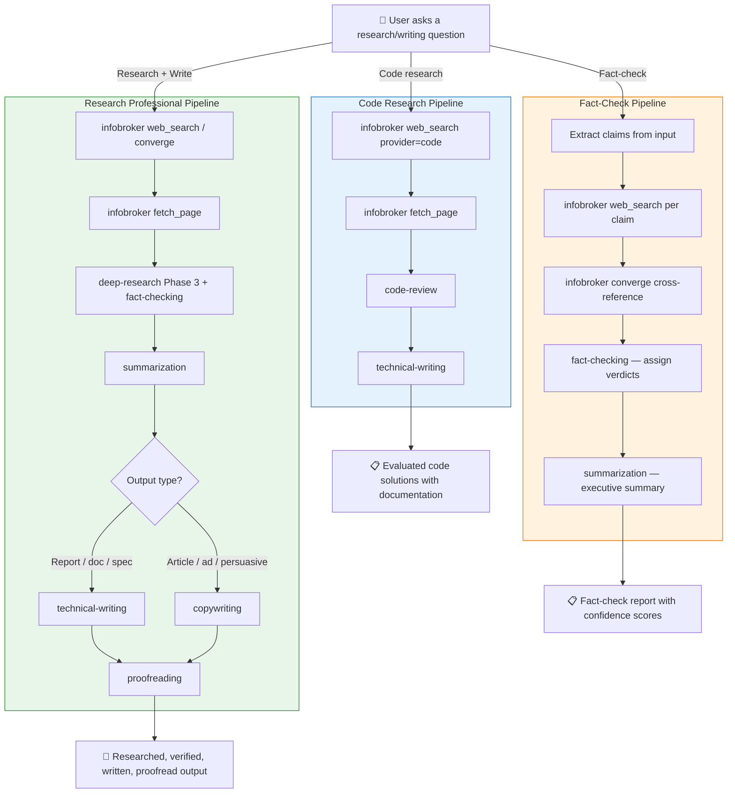

# Skill Pipeline



## Skill Dependency Graph

```
infobroker (orchestrator)
  ├── deep-research (sub-skill: Phase 3 verify, Phase 4 synthesize)
  ├── fact-checking (sub-skill: claim verdicts)
  ├── summarization (sub-skill: condense findings)
  ├── technical-writing (sub-skill: write docs/reports)
  ├── copywriting (sub-skill: write persuasive content)
  ├── proofreading (sub-skill: polish output)
  ├── code-review (sub-skill: evaluate code solutions)
  └── translation (sub-skill: multilingual output)

All sub-skills can be used standalone.
infobroker skill provides the pipeline orchestration.
```

## Client Instructions

`search-preferences.md` maps user intent to Infobroker tools.
It is loaded as an OpenCode instruction file and must appear
before any conflicting instruction files in the config.
