# Skill Pipeline

```mermaid
flowchart TD
    U["👤 User asks a research question"]

    U --> C["infobroker Phase 0: Classify intent → workflow shape"]

    C -->|"Research & Write"| RP
    C -->|"Fact-Check"| FC
    C -->|"Competitive Evaluation"| EV
    C -->|"Literature Review"| LR
    C -->|"Monitoring / Delta"| MO
    C -->|"Adversarial / Red-Team"| RT
    C -->|"Vetting / Due-Diligence"| VE
    C -->|"high-stakes rigor"| AL

    subgraph RP["Research & Write"]
        RPr["web_search / verify_claims"] --> RPe["fetch_page"]
        RPe --> RPv["verify & triangulate"]
        RPv --> RPs["summarization"]
        RPs --> RPw["technical-writing"]
        RPw --> RPp["proofreading"]
        RPp --> RPt["translation (optional)"]
    end

    subgraph FC["Fact-Check"]
        FCc["extract claims → web_search → verify_claims"] --> FCv["assign verdicts"]
    end

    subgraph EV["Competitive Evaluation"]
        EVc["criteria → web_search per option → matrix"] --> EVv["recommendation"]
    end

    subgraph LR["Literature Review"]
        LRc["criteria → scholarly search → dedupe → screen"] --> LRs["themes + gaps"]
    end

    subgraph MO["Monitoring / Delta"]
        MOc["baseline → re-search → diff"] --> MOd["change report"]
    end

    subgraph RT["Adversarial / Red-Team"]
        RTc["restate claim → disconfirming search"] --> RTw["weakness register"]
    end

    subgraph VE["Vetting / Due-Diligence"]
        VEc["checklist → per-item search → verify_claims"] --> VEv["red-flag register"]
    end

    subgraph AL["Analysis Loop (escalation)"]
        ALm["scope → collect → analyze → refine"]
    end

    C -->|"→ shared primitives + output token"| WF["references/workflows.md"]

    style RP fill:#e8f5e9,stroke:#2e7d32
    style FC fill:#fff3e0,stroke:#ef6c00
    style AL fill:#f3e5f5,stroke:#6a1b9a
    style EV fill:#e3f2fd,stroke:#1565c0
    style LR fill:#fce4ec,stroke:#c2185b
    style MO fill:#fff8e1,stroke:#f9a825
    style RT fill:#efebe9,stroke:#4e342e
    style VE fill:#e8eaf6,stroke:#283593
    style WF fill:#eceff1,stroke:#546e7a
```



## Skill Dependency Graph

```
infobroker (orchestrator + router)
  ├── Phase 0 Classify → references/workflows.md (workflow shapes)
  ├── summarization (sub-skill: condense findings)
  ├── technical-writing (sub-skill: write docs/reports)
  ├── proofreading (sub-skill: polish output)
  └── translation (sub-skill: multilingual output)

analysis-loop (sibling — routed by the orchestrator's Phase 0 classify gate
  when the shape is Gated Analysis; consumed directly by Infobroker tools)

All sub-skills can be used standalone.
infobroker skill provides the pipeline orchestration and workflow routing.
```

## Client Instructions

`search-preferences.md` maps user intent to Infobroker tools.
It is loaded as an OpenCode instruction file and must appear
before any conflicting instruction files in the config.
